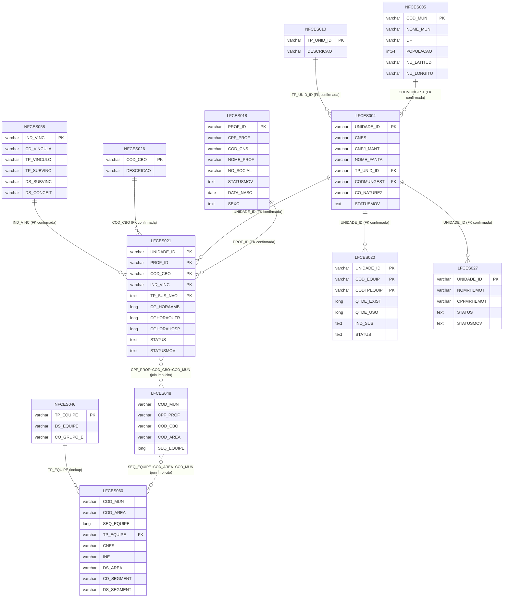

# Diagrama ER — CNES Firebird (CNES.GDB)

> Gerado em 2026-04-05 a partir dos resultados de `data/discovery/01_indices_e_constraints.csv`.
> Relacionamentos confirmados via `RDB$RELATION_CONSTRAINTS`. Joins implícitos marcados com linha tracejada.

## Diagrama

## Notas

| Símbolo | Significado |
|---|---|
| `PK` | Chave primária |
| `FK` | Chave estrangeira declarada (confirmada via `RDB$RELATION_CONSTRAINTS`) |
| `||--o{` | Um-para-muitos com FK declarada |
| `}o..o{` | Join implícito — sem FK declarada no schema Firebird |

### Tabelas Omitidas

- **NFCES088** — Snapshot desnormalizado (profissional × estabelecimento). Vista somente-leitura; não possui relações FK próprias.
- **LFCES000** — Configuração técnica da instalação local. Sem relação com dados de auditoria.
- Demais 240+ tabelas LFCES/NFCES — fora do escopo do pipeline municipal.

### Joins Implícitos (sem FK declarada)

O Firebird **não** impõe integridade referencial nestas junções:

1. `LFCES021 → LFCES048`: via `CPF_PROF + COD_CBO + COD_MUN`
2. `LFCES048 → LFCES060`: via `SEQ_EQUIPE + COD_AREA + COD_MUN`

Em `cnes_client.py`, estes joins são executados como `LEFT JOIN` para tolerar ausência de correspondência.
