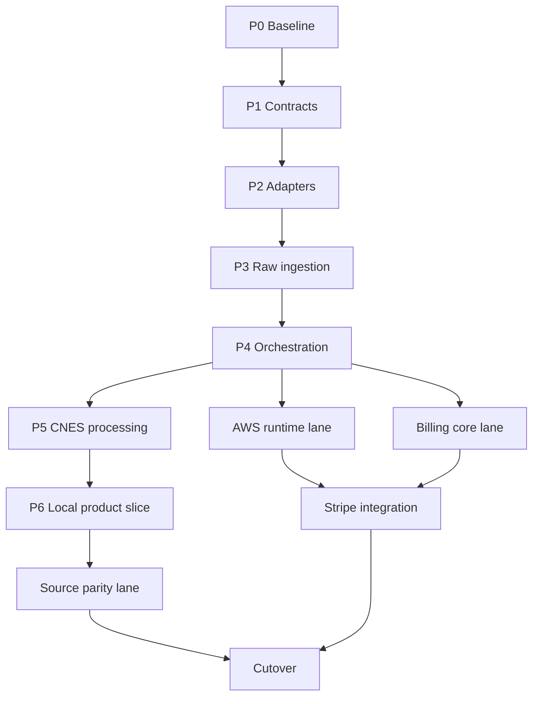

# CnesData — Redesign Execution and Parallel Worktree Design

**Status:** approved for canonical documentation; awaiting pull-request review

**Date:** 2026-08-23

**Integration base:** `develop`

**Repository:** `VINIClUS/CnesData`

**Source designs:**

- [Data Plane Parquet e Orquestração — V2](2026-08-16-parquet-data-plane-orchestration-design.md)
- [Stripe Billing, Entitlements e Revogação](2026-08-16-stripe-billing-entitlements-design.md)

## 1. Purpose

Define how the two approved architectural designs will be converted into an
implementation backlog and executed safely by parallel agents in isolated Git
worktrees.

This document owns execution order, dependency gates, worktree boundaries,
integration policy, and rollout sequencing. It does not replace the domain and
infrastructure decisions in the source designs.

## 2. Repository baseline

At the time this design was approved:

- `develop` was the architectural base required by the source designs;
- `develop` was 148 commits ahead of and 5 commits behind `main`;
- there were no open pull requests;
- the only open issue was unrelated to the redesign;
- the central API and processor still depended directly on PostgreSQL and MinIO;
- the target control-plane, dataset, run, entitlement, and audit ports did not exist;
- the Go Edge Agent already implemented source discovery, delta detection, SHA-256,
  a durable local outbox, circuit breaking, jittered retry, diagnostics, and mTLS.

The existing Go Edge Agent is evolved in place. It is not rewritten.

## 3. Binding constraints

The following decisions are inherited unchanged from the approved source designs:

- `local` is single-tenant, one installation per municipality;
- `local` uses SQLite and filesystem storage;
- `aws` is multi-tenant and uses DynamoDB and S3;
- PostgreSQL/RDS, MinIO, Keycloak, and BigQuery are absent after cutover;
- Parquet objects and published dataset versions are immutable;
- dashboard navigation reads materialized serving JSON, not Athena or raw Parquet;
- processing is at-least-once with idempotency, leases, and fencing;
- Edge Agents perform extraction and transport transformations only;
- normalization, reconciliation, and serving materialization are central concerns;
- Stripe is enabled only in the AWS SaaS profile;
- local billing is disabled and has no remote validation;
- critical authorization and publication do not depend on a stale cache, GSI, or TTL;
- SIHD, BPA, and SIA may use the legacy path only during migration;
- the final legacy removal gate requires every retained active source to be migrated.

## 4. Delivery strategy

### 4.1 Chosen approach

Use an incremental, contract-first, CNES-first migration.

The first production-shaped vertical slice is:

```text
CNES_LOCAL + CNES_NACIONAL
  -> immutable raw manifests and Parquet
  -> normalized Parquet per source
  -> reconciliation Parquet
  -> materialized serving JSON
  -> authorized dashboard access
```

The legacy path may coexist temporarily in `shadow` mode. Runtime compatibility
with PostgreSQL, MinIO, Keycloak, or BigQuery is removed after source parity and
cutover acceptance.

### 4.2 Rejected approaches

**Adapter-first without a vertical slice** was rejected because it delays evidence
that the contracts produce a usable dataset and dashboard response.

**Big-bang rewrite** was rejected because it creates a long-lived integration branch,
couples unrelated failure domains, and postpones parity testing until the end.

**Rewriting the Edge Agent** was rejected because its existing resilience and source
capabilities are reusable and independently tested.

## 5. Subprojects

The redesign is split into four implementation plans. Each plan must produce
independently testable software.

| Plan | Scope | Entry gate | Completion gate |
|---|---|---|---|
| Data Plane Foundation and Local Profile | Domain contracts, ports, adapter implementations, orchestration, CNES processing, local auth and serving | Reconciled green baseline | Local CNES vertical slice passes acceptance tests |
| AWS Runtime Profile | DynamoDB/S3 composition, generic OIDC, Step Functions/ECS execution, audit sink and signed serving access | Stable adapters and orchestration contracts | AWS profile passes integration suites |
| Billing and Entitlements | Billing domain, Stripe flows, projection, quotas, revocation, cache policy and reconciliation | Stable `RunAuthorization`, fencing, publisher, and AWS control plane | Stripe test-clock and revocation E2E suites pass |
| Source Migration and Cutover | SIHD/BPA/SIA parity, historical shadow runs, frontend cutover, legacy export and removal | Local CNES vertical slice is stable | No retained source or runtime depends on legacy services |

Production AWS resource provisioning is not inferred in these application plans.
Infrastructure-as-code requires a dedicated deployment specification before cloud
resources are created. Application adapters, workflows, IAM requirements, and test
environments remain in scope.

## 6. Dependency graph



Billing domain work may begin after the orchestration contracts are stable. Stripe
integration does not begin until the AWS control plane and critical fencing paths are
available.

## 7. Backlog phases

Logical IDs are stable backlog identifiers and are not GitHub issue numbers.

### Phase 0 — Integration baseline

This phase is serial.

| ID | Deliverable | Depends on | Unlocks |
|---|---|---|---|
| `CND-000` | Reconcile `main` into `develop` through a dedicated PR | None | All implementation work |
| `CND-001` | Run and record the baseline Python, Go, dashboard, and integration test matrix | `CND-000` | Reliable regression attribution |
| `CND-002` | Freeze existing source contracts, representative raw fixtures, Gold outputs, and dashboard KPIs | `CND-001` | Golden and shadow tests |
| `CND-003` | Add backlog conventions, issue template, branch naming, and path-ownership policy | `CND-000` | Parallel worktree dispatch |

No feature agent starts before `CND-001` is green or explicitly waived with a recorded
baseline failure.

### Phase 1 — Canonical contracts and ports

Wave 1 contains two independent worktrees:

| ID | Deliverable | Owned paths |
|---|---|---|
| `CND-010` | Control-plane entities, immutable values, state enums, transition rules, and domain errors | `packages/cnes_domain/src/cnes_domain/control_plane/**`; matching tests |
| `CND-011` | `RawManifest`, delta-chain, output, run, reconciliation, serving, and audit event contracts | `packages/cnes_contracts/src/cnes_contracts/manifests/**`; matching tests |

Wave 2 begins after both are integrated:

| ID | Deliverable | Depends on |
|---|---|---|
| `CND-012` | `ControlPlanePort`, `ObjectStorePort`, `ProcessorExecutorPort`, `ServingAccessPort`, and `AuditSinkPort` | `CND-010`, `CND-011` |
| `CND-013` | Shared adapter contract suites for control plane and object store invariants | `CND-012` |
| `CND-014` | Profile configuration contract for `local` and `aws`, plus `AUTH_MODE` and `BILLING_MODE` validation | `CND-012` |

Existing SQLAlchemy-bearing protocols are not expanded. New target ports remain free
of SQL, DynamoDB expressions, S3 paths, and framework-specific request types.

### Phase 2 — Persistence and object-store adapters

Three feature worktrees run concurrently after `CND-013`:

| ID | Deliverable | Worktree boundary |
|---|---|---|
| `CND-020` | SQLite control-plane adapter with transactions, constraints, claims, CAS, idempotency, and outbox | SQLite adapter and tests only |
| `CND-021` | DynamoDB control-plane adapter with base-key revalidation, conditional writes, transactions, and TTL-safe semantics | DynamoDB adapter and tests only |
| `CND-022` | Filesystem and S3 object-store adapters with identical contract behavior | Object-store adapters and tests only |

The next wave contains:

| ID | Deliverable | Depends on |
|---|---|---|
| `CND-023` | Local JSONL/Parquet and AWS S3 Object Lock audit sinks | `CND-012` |
| `CND-024` | Outbox dispatcher with idempotent delivery and recovery | `CND-020`, `CND-021`, `CND-023` |
| `CND-025` | Full adapter conformance matrix against SQLite, DynamoDB Local, filesystem, and an S3-compatible test environment | `CND-020` through `CND-024` |

Agents do not edit shared dependency manifests or package exports. A serial integration
task applies `pyproject.toml`, `uv.lock`, and export changes after feature branches are
accepted.

### Phase 3 — Raw ingestion and Edge Agent protocol

Wave 1 uses three independent worktrees:

| ID | Deliverable | Boundary |
|---|---|---|
| `CND-030` | Raw manifest validator, delta-chain policy, full-resync decisions, and immutable object registration | Python application/domain services |
| `CND-032` | Go Edge Agent manifest v1, snapshot sequence/hash chain, object layout, and full-resync response handling | `apps/dump_agent_go` |
| `CND-033` | DATASUS national adapter producing the same raw contract without BigQuery | National ingestion adapter and tests |

Wave 2 adds `CND-031`, the Central API raw-upload and job endpoints wired only
through the target ports. It depends on `CND-030`. `CND-034` then integrates the
four deliverables into an end-to-end raw ingestion test. Legacy
routes may remain available only under the migration mode during this phase.

### Phase 4 — Jobs, runs, fan-out, and atomic publication

Wave 1:

| ID | Deliverable | Depends on |
|---|---|---|
| `CND-040` | Edge `Job` lifecycle, agent revocation check, lease renewal, retry, cancellation, and fencing | `CND-020`, `CND-021`, `CND-030` |
| `CND-041` | `Run` planner, deterministic `RunUnit` IDs, required/optional dependencies, fan-out, fan-in, and degraded publication rules | `CND-010`, `CND-011` |
| `CND-042` | Local worker-pool and AWS executor adapters behind `ProcessorExecutorPort` | `CND-012`, `CND-041` |

Wave 2:

| ID | Deliverable | Depends on |
|---|---|---|
| `CND-043` | Unit claim/commit with attempt paths and stale-fence rejection | `CND-040`, `CND-041` |
| `CND-044` | Atomic publisher: final immutable objects, `RunManifest`, `DatasetVersion`, pointer CAS, and outbox in one control-plane transaction | `CND-022`, `CND-024`, `CND-043` |
| `CND-045` | Race and crash suite for dual claims, stale workers, competing publishers, and audit replay | `CND-043`, `CND-044` |

### Phase 5 — CNES processing vertical slice

The two normalizers are independent:

| ID | Deliverable | Depends on |
|---|---|---|
| `CND-050` | `NormalizeSource` for `CNES_LOCAL`, including delta reconstruction and provenance | `CND-030`, `CND-043` |
| `CND-051` | `NormalizeSource` for `CNES_NACIONAL` from the DATASUS raw contract | `CND-033`, `CND-043` |

Dependent tasks:

| ID | Deliverable | Depends on |
|---|---|---|
| `CND-052` | `ReconcileCompetencia` with approved precedence, evidence, divergence, and KPI contracts | `CND-050`, `CND-051` |
| `CND-053` | `MaterializeServing` with versioned, minimal JSON schemas | `CND-052` |
| `CND-054` | Golden and shadow comparison against frozen PostgreSQL Gold fixtures | `CND-002`, `CND-052`, `CND-053` |

Statistical proximity is not acceptance. Every difference must be explained by an
approved contract or rule change.

### Phase 6 — Local product slice

After the serving contract is frozen, Wave 1 uses three independent lanes:

| ID | Deliverable | Boundary |
|---|---|---|
| `CND-060` | Local bootstrap with SQLite/filesystem and no cloud or legacy-service dependency | Application bootstrap and local configuration |
| `CND-061` | Local password authentication and optional generic OIDC mapped to server-side membership and fixed tenant | Authentication and membership modules |
| `CND-062` | Serving BFF and signed/authorized access policy | Central API serving routes |

Wave 2 adds `CND-063`, the dashboard migration to serving JSON and fixed local
tenant semantics. It depends on `CND-062` and owns `apps/web_dashboard`.

`CND-064` is the local acceptance gate: restart persistence, full/delta ingestion,
fencing, publication recovery, authorized dashboard access, and backup/restore of
non-derivable control-plane state.

### Phase 7 — Parallel expansion lanes

After `CND-064`, the following source migrations are independent and may run in
separate worktrees:

| ID | Deliverable |
|---|---|
| `SRC-010` | SIHD raw, normalized, reconciliation, and serving parity |
| `SRC-011` | BPA raw, normalized, reconciliation, and serving parity |
| `SRC-012` | SIA raw, normalized, reconciliation, and serving parity |

The AWS runtime lane may begin after Phase 4:

| ID | Deliverable |
|---|---|
| `AWS-010` | AWS profile bootstrap using DynamoDB and S3 adapters |
| `AWS-011` | Generic OIDC tenant resolution and membership authorization |
| `AWS-012` | Step Functions Standard Inline Map and ECS task integration |
| `AWS-013` | CloudWatch operational logs, S3 audit delivery, and signed serving access |
| `AWS-014` | Cross-tenant, stale-GSI, failure, and recovery integration suite |

The billing core lane may also begin after Phase 4:

| ID | Deliverable |
|---|---|
| `BIL-010` | `BillingAccount`, immutable `PlanVersion`, `EntitlementSnapshot`, and local disabled mode |
| `BIL-011` | `EntitlementGate` and immutable `RunAuthorization` |
| `BIL-012` | DynamoDB entitlement projection, consistent critical gates, and short local cache |
| `BIL-013` | Atomic quota and budget reservation lifecycle |

Stripe integration follows the AWS and billing-core gates:

| ID | Deliverable | Depends on |
|---|---|---|
| `BIL-020` | Hosted Checkout and Customer Portal with billing-owner authorization | `AWS-011`, `BIL-010` |
| `BIL-021` | Signed webhook inbox, deduplication, reorder-safe projection, retry, and recovery | `AWS-010`, `BIL-012` |
| `BIL-022` | Immediate revocation, run cancellation request, fence increment, and publication denial | `CND-044`, `BIL-011`, `BIL-021` |
| `BIL-023` | Stripe reconciliation, audit, metrics, and alerts | `BIL-021`, `BIL-022` |
| `BIL-024` | Stripe test-clock E2E for trial, renewal, payment failure, period-end cancellation, and immediate revocation | `BIL-020` through `BIL-023` |

### Phase 8 — Migration and cutover

| ID | Deliverable | Depends on |
|---|---|---|
| `MIG-010` | Historical shadow runs and per-source equivalence report | `CND-054`, retained `SRC-*` tasks |
| `MIG-011` | Frontend and serving cutover to active `DatasetPointer` | `CND-064`, `MIG-010` |
| `MIG-012` | Stop new writes to PostgreSQL and MinIO | `MIG-011` |
| `MIG-013` | Export required history to immutable Parquet and verify hashes/manifests | `MIG-012` |
| `MIG-014` | Remove PostgreSQL, MinIO, BigQuery, and Keycloak runtime code, migrations, deployment config, and documentation | `MIG-013` |
| `MIG-015` | Final local and AWS acceptance matrix | `MIG-014`, `AWS-014`, and `BIL-024` when SaaS billing is released |

Removal is never scheduled in parallel with the code paths it deletes.

## 8. Worktree and agent policy

### 8.1 Concurrency

Use at most three implementation worktrees at once while retaining one controller
lane for integration, review, and full-suite verification.

An agent receives exactly one independently reviewable task. Related tasks that edit
the same aggregate or bootstrap file stay in one worktree or run sequentially.

### 8.2 Branch naming

```text
feat/<logical-id-lowercase>-<short-scope>
fix/<logical-id-lowercase>-<short-scope>
test/<logical-id-lowercase>-<short-scope>
docs/<logical-id-lowercase>-<short-scope>
```

Examples:

```text
feat/cnd-020-sqlite-control-plane
feat/cnd-032-edge-raw-manifest-v1
feat/bil-021-stripe-webhook-projection
```

Every branch starts from the latest green `develop` commit containing all declared
dependencies. Dependent branches are not pre-created from stale integration heads.

### 8.3 Shared-file ownership

The following files and surfaces are integration-owned unless an issue explicitly
grants ownership:

- root and package `pyproject.toml` files;
- `uv.lock`, Go module lock changes spanning another task, and frontend lockfiles;
- package `__init__.py` exports used by multiple tasks;
- application bootstrap and dependency-injection composition roots;
- generated OpenAPI and JSON Schema artifacts;
- root documentation indexes and roadmap;
- Docker Compose, CI workflows, and deployment-wide configuration.

Feature agents expose new modules through direct imports in their tests. A serial
integration task updates shared exports, dependency manifests, lockfiles, generated
contracts, and composition roots after feature review.

### 8.4 Agent task packet

Each dispatched task contains:

- goal and explicit non-goals;
- source design sections that govern the task;
- dependency commit SHA;
- allowed and forbidden paths;
- consumed and produced interfaces with exact names and types;
- failing test to write first;
- targeted test, lint, type, race, and coverage commands;
- acceptance criteria;
- required return: root cause or design notes, changed files, verification evidence,
  and unresolved risks.

## 9. Integration and review gates

Every implementation task follows this sequence:

1. create an isolated worktree from the dependency-complete `develop` head;
2. run the task-specific baseline test;
3. write a failing behavior test;
4. implement the smallest compliant change;
5. run targeted lint, type, test, race, and coverage checks;
6. perform specification-compliance review;
7. perform code-quality review;
8. open a PR against `develop`;
9. integrate only after required checks and reviews pass;
10. run the wave-level suite before dispatching dependents.

Current repository quality constraints remain binding:

- Python package coverage: 100% branch where already enforced;
- Python app coverage: 90% line where already enforced;
- Go Edge Agent: race-enabled suite and at least 65% filtered coverage;
- dashboard: lint, typecheck, unit tests, build, and relevant E2E tests;
- function body at most 50 lines;
- cyclomatic complexity at most 10;
- line width at most 100 characters;
- file length at most 500 lines;
- no direct commits to `main`.

Adapter phases additionally require the shared contract suites. Orchestration phases
require property, race, and crash tests. Migration phases require golden and shadow
evidence.

## 10. Issue topology

Create four epic issues corresponding to the implementation plans. Atomic issues use
the logical IDs in this document.

Every issue body includes:

```markdown
## Goal
## Non-goals
## Depends on
## Unlocks
## Governing design sections
## Allowed paths
## Forbidden shared paths
## Interfaces consumed
## Interfaces produced
## Test-first steps
## Acceptance criteria
## Verification commands
## Worktree and branch
```

Only Phase 0 and Phase 1 atomic issues are created immediately after plan approval.
Later atomic issues are materialized when their upstream interfaces are stable, using
the phase definitions here as the authoritative backlog. This prevents stale file
paths and signatures from being copied into dozens of premature issues.

## 11. Definition of ready

A task is ready for dispatch only when:

- all `Depends on` tasks are merged into `develop`;
- consumed interfaces exist at the documented signatures;
- allowed paths do not overlap another active task;
- the baseline test command is known and runnable;
- fixtures or external emulators required by the task are available;
- the acceptance criteria can be verified without another unmerged branch.

## 12. Definition of done

A task is done only when:

- behavior and negative tests pass;
- relevant contract, property, race, security, and recovery tests pass;
- lint, type, coverage, and build gates pass;
- no forbidden dependency or legacy coupling was introduced;
- generated artifacts are updated by the integration lane when applicable;
- the PR documents consumed and produced interfaces;
- the wave-level suite remains green after integration.

A phase is done only when its final gate is green on integrated `develop`, not when
individual worktrees pass in isolation.

## 13. Execution handoff

After this design is reviewed, create four detailed implementation plans:

1. Data Plane Foundation and Local Profile;
2. AWS Runtime Profile;
3. Billing and Entitlements;
4. Source Migration and Cutover.

The first executable backlog contains `CND-000` through `CND-014`. Phase 0 begins
with branch reconciliation and baseline verification; implementation worktrees begin
only after that gate.
