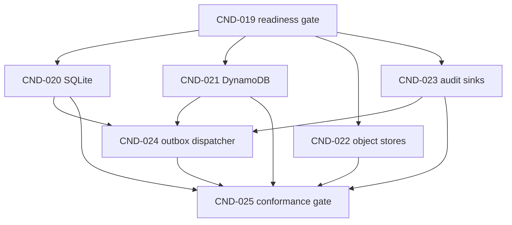

# CnesData Phase 2 Readiness and Adapter Hardening Design

**Status:** Proposed amendment for review  
**Date:** 2026-08-28  
**Tracker:** [#93](https://github.com/VINIClUS/CnesData/issues/93)  
**Epic:** [#97](https://github.com/VINIClUS/CnesData/issues/97)  
**Integration base inspected:** `develop@e861bc140c09dd1680e8a0362837e22be83e63a6`

## 1. Purpose and precedence

This document hardens the entry gate, delivery graph, ownership, and backend-specific
invariants for Phase 2 of the CnesData redesign.

It is an additive amendment to:

- `docs/superpowers/specs/2026-08-23-cnesdata-redesign-execution-design.md`;
- `docs/superpowers/plans/2026-08-23-cnesdata-data-plane-local-profile-implementation-plan.md`;
- `docs/superpowers/specs/2026-08-16-parquet-data-plane-orchestration-design.md`.

After merge, this amendment governs the Phase 2 entry gate, dependencies, worktree waves,
and the technical decisions explicitly listed here. The earlier documents continue to
govern all non-conflicting behavior, especially the accepted domain entities, ports,
request values, manifest schemas, and shared adapter cases delivered in Phase 1.

The root and package `CLAUDE.md` files still describe parts of the legacy architecture.
They are not being broadly rewritten in this phase. For all files owned by CND-019 through
CND-025, the three documents above plus this amendment take precedence over conflicting
legacy descriptions.

## 2. Evidence snapshot

The planning decision is based on the following repository state on 2026-08-28:

- Phase 1 logical items CND-010 through CND-014 are closed and integrated through PR #118.
- The accepted interfaces exist under `packages/cnes_domain/src/cnes_domain/control_plane/`
  and `packages/cnes_domain/src/cnes_domain/ports/`.
- The reusable control-plane and object-store cases exist under
  `packages/cnes_infra/tests/contracts/`.
- The target Phase 2 implementation directories `cnes_infra/control_plane`,
  `cnes_infra/object_store`, and `cnes_infra/audit` do not yet exist.
- PR #118's CI run
  [33168644394](https://github.com/VINIClUS/CnesData/actions/runs/33168644394)
  failed at `ruff check .` with 14 `PLR0917` findings; migration and test steps were skipped.
- The push run for the resulting `develop` merge commit,
  [33168995825](https://github.com/VINIClUS/CnesData/actions/runs/33168995825),
  failed at the same lint step.
- `develop` is not protected and its merge commit therefore exists despite a failed check.
- `scripts/baseline_matrix.py` accepts the two historical waived suites by commit SHA,
  suite name, and exit code, but does not verify that the observed failure is the approved
  missing-module failure recorded in `docs/baselines/2026-08-23-develop.json`.

Consequently, the Phase 1 artifacts are present, but the literal Phase 2 definition of
ready in #93 is not satisfied. Phase 2 feature work must not branch directly from this
state.

## 3. Goals and non-goals

### Goals

- Restore a demonstrably green, reproducible `develop` before adapter work begins.
- Deliver SQLite and DynamoDB implementations of `ControlPlanePort` with equivalent
  observable semantics.
- Deliver filesystem and S3 implementations of `ObjectStorePort` with immutable,
  hash-checked publication.
- Deliver local JSONL and CloudWatch implementations of `AuditSinkPort`.
- Connect the transactional outbox to audit sinks with explicit at-least-once semantics.
- Prove conformance in an integrated matrix before Phase 2 is declared complete.
- Keep at most three feature worktrees active and isolate repository-global files in the
  controller lane.

### Non-goals

- Runtime profile composition, orchestration, raw ingestion, or CNES processing from later
  phases.
- A broad cleanup of legacy documentation or unrelated application APIs.
- A claim that Moto, LocalStack, or any local emulator proves AWS Object Lock/WORM behavior.
- Cross-host SQLite operation on NFS, SMB, or another network filesystem.
- Exactly-once delivery to CloudWatch Logs.
- Creating CND-020 through CND-025 before the readiness gate is merged and green.

## 4. Readiness gate: CND-019

CND-019 is a controller-lane preflight, not a feature worktree. Its purpose is to turn the
tracker's existing definition of ready into verified evidence.

The gate must:

1. Make the repository lint command green using the same Ruff version locally and in CI.
   The current mismatch is concrete: `uv.lock` resolves Ruff 0.15.11 while CI installed
   unpinned Ruff 0.16.5.
2. Make the already locked Phase 2 test dependencies available in CI: Moto 5.2.3 and
   Testcontainers 4.14.2. Feature lanes must not need to edit the global CI installer.
3. Keep any lint compatibility exceptions scoped to exact pre-existing paths; a global
   suppression of `PLR0917` is not acceptable.
4. Make the fast baseline collect without the historical missing
   `cnes_infra.storage.repositories.estabelecimento_repo` module aborting collection.
   Performance modules whose legacy subject is absent may skip explicitly at import time;
   an unrelated collection error may not be waived.
5. Harden `_waiver_for` so approval requires the approved commit, suite, exit code, and
   exact normalized failure signature. A different failure with exit code 2 must fail the
   matrix.
6. Produce a fresh baseline report for the reviewed readiness commit. No new waiver may be
   introduced for a Phase 2 implementation failure.
7. Obtain a successful GitHub Actions CI run for the CND-019 PR and for its integrated
   `develop` commit before any CND-020 through CND-025 branch is created.

Because `develop` is currently unprotected, the controller must record both successful run
URLs in the CND-019 issue. The absence of branch protection is not evidence of readiness.

## 5. Delivery graph

CND-024 intentionally does not depend on CND-022. It consumes `ControlPlanePort` and
`AuditSinkPort`, not `ObjectStorePort`. Waiting for object stores would create an artificial
barrier.

## 6. Atomic backlog and branch names

| Logical ID | Title | Branch | Dependencies | Lane |
|---|---|---|---|---|
| CND-019 | Phase 2 readiness gate | `fix/cnd-019-phase2-readiness` | CND-014 integrated | Controller |
| CND-020 | SQLite control-plane adapter | `feat/cnd-020-sqlite-control-plane` | CND-019 | Feature A/B/C |
| CND-021 | DynamoDB control-plane adapter | `feat/cnd-021-dynamodb-control-plane` | CND-019 | Feature A/B/C |
| CND-022 | Filesystem and S3 object stores | `feat/cnd-022-object-stores` | CND-019 | Feature A/B/C |
| CND-023 | Local and CloudWatch audit sinks | `feat/cnd-023-audit-sinks` | CND-019 | First freed feature lane |
| CND-024 | Transactional outbox dispatcher | `feat/cnd-024-outbox-dispatcher` | CND-020, CND-021, CND-023 | Feature lane |
| CND-025 | Phase 2 adapter conformance gate | `test/cnd-025-adapter-conformance` | CND-020 through CND-024 | Controller |

Logical IDs are stable; GitHub issue numbers are assigned only when materialized.

## 7. Worktree waves

| Wave | Controller lane | Feature A | Feature B | Feature C | Exit gate |
|---|---|---|---|---|---|
| W6 | CND-019 | — | — | — | CND-019 merged; CI green on integrated `develop` |
| W7 | integration/review | CND-020 | CND-021 | CND-022 | Each adapter passes its owned tests |
| W7b | integration/review | CND-023 in first lane freed by a merged W7 item | remaining W7 work | remaining W7 work | Audit contract green |
| W8 | integration/review | CND-024 after 020, 021, and 023 merge | CND-022 may finish independently | — | Outbox matrix green |
| W9 | CND-025 | — | — | — | Full Phase 2 gate green on integrated `develop` |

A worktree is freed only after its issue is merged. A dependent branch is always cut from
the latest green `develop` containing every declared dependency.

## 8. Path ownership

Feature issues own new leaf modules and their focused tests. They must not modify shared
package exports, dependency manifests, lockfiles, CI, Compose, generated contracts, global
configuration, or roadmap files.

| Item | Exclusive implementation paths | Deferred controller paths |
|---|---|---|
| CND-020 | `cnes_infra/control_plane/sqlite.py`, SQLite tests | `control_plane/__init__.py` |
| CND-021 | `cnes_infra/control_plane/dynamodb.py`, DynamoDB tests | `control_plane/__init__.py`, emulator wiring |
| CND-022 | `cnes_infra/object_store/filesystem.py`, `s3.py`, owned tests | `object_store/__init__.py` |
| CND-023 | `cnes_infra/audit/local.py`, `cloudwatch.py`, audit contract and owned tests | `audit/__init__.py` |
| CND-024 | `cnes_infra/audit/outbox.py`, dispatcher tests | shared exports and profile wiring |
| CND-025 | conformance matrix and integration tests | all three `__init__.py` files, CI, Compose, manifests, locks, shared config |

The three subpackage `__init__.py` files do not exist at the inspected base. They are
created once by CND-025 to avoid add/add conflicts between parallel worktrees.

## 9. Control-plane persistence decisions

### 9.1 Shared semantics

Both adapters implement the accepted `ControlPlanePort` and execute every reusable case in
`control_plane_contract.py`. In particular:

- tenant isolation is part of every key and query;
- compare-and-set state transitions, leases, fencing tokens, publication, and paired
  outbox writes are atomic;
- replay with the same idempotency key and request hash returns the original outcome;
- reuse with a different request hash conflicts;
- no failed transition may leave a partial domain mutation or orphan outbox event;
- ordering and limits are deterministic and equivalent across backends.

### 9.2 SQLite

- Use the standard `sqlite3` driver and explicit transactions.
- Enable foreign keys, a bounded busy timeout, and WAL mode on a local filesystem.
- Serialize write operations with `BEGIN IMMEDIATE`; readers may continue under WAL.
- Open connections per operation or per explicitly owned unit of work; do not share a
  mutable connection implicitly across threads.
- Store UTC timestamps in a canonical representation and compare them consistently.
- Enforce identity, transition, idempotency, and outbox uniqueness in schema constraints as
  well as adapter logic.
- WAL is supported only when every process accesses the database on the same host. NFS,
  SMB, and cross-host mounts are rejected configuration, not degraded support.

### 9.3 DynamoDB

- Use a single-table key design with tenant-prefixed base keys.
- A query through a GSI returns candidates only. Before a claim, transition, recovery, or
  outbox decision, strongly reread the base item and re-evaluate state, lease, and fence.
- TTL is cleanup only. Expiry-sensitive behavior compares `expires_at` synchronously; it
  never assumes the item has been physically deleted.
- `TransactWriteItems` contains at most 100 actions and cannot target the same item twice.
  Transaction builders must deduplicate keys and reject overflow before sending a request.
- With one run condition/action plus unit puts, `put_run_units` has a physical maximum of
  99 units. The contract boundary tests 99 success and 100 rejection.
- With one run action, unit actions, and one outbox action,
  `finalize_run_cancellation` has a physical maximum of 98 units. The boundary tests 98
  success and 99 rejection. Later orchestration must cap production waves at 98 units so
  all terminal operations remain representable.
- Moto is acceptable for fast request-shape and condition tests. CND-025 must also execute
  the adapter against
  `amazon/dynamodb-local:3.3.1@sha256:ff89bd48ff32cd8d9be5fee8873b65b8854dc408f1afe881be6eb00247bc0dab`
  because emulator behavior is part of the Phase 2 evidence.

## 10. Object-store decisions

### 10.1 Shared semantics

- Keys are relative, normalized POSIX-style paths with no empty, `.`, `..`, absolute, or
  backslash segments.
- `put` and `promote` verify SHA-256 before publication.
- Repeating the same operation with identical bytes is idempotent.
- Publishing different bytes to an existing immutable key raises `Conflict` and never
  alters the existing object.
- A reader observes either the complete old object or the complete new object, never a
  partial payload.

### 10.2 Filesystem

`os.replace` is not a valid immutable publish primitive because it overwrites an existing
destination. The adapter instead writes a uniquely named temporary file in the destination
directory, flushes and `fsync`s it, verifies the digest, and atomically links/publishes it
with no-overwrite semantics. It then `fsync`s the parent directory before removing the
temporary name. `EEXIST` is resolved by hashing the existing destination: identical content
is idempotent; different content is a conflict.

Focused concurrency tests race multiple writers against the same key with identical and
different content and assert that no partial file or orphan temporary file remains.

### 10.3 S3

- Create immutable destinations with `IfNoneMatch="*"`.
- Treat HTTP 412 as an existing-destination decision and HTTP 409
  `ConditionalRequestConflict` as a race requiring a bounded reread/retry. A retry never
  falls back to an unconditional overwrite.
- On an existing key, compare stored SHA-256 metadata and, when necessary, the object body
  before returning idempotent success or `Conflict`.
- Implement `promote` through a destination-conditional upload; a source-only conditional
  copy is insufficient to protect the destination.
- When Object Lock retention headers are enabled, provide `Content-MD5` or a supported SDK
  checksum and verify the response.
- Moto's S3 coverage does not establish retention enforcement. Phase 2 tests standard
  object operations and request construction, labels Object Lock as an unverified
  capability, and defers the real WORM claim to an AWS validation gate.

## 11. Audit and outbox decisions

### 11.1 Local audit sink

The local sink appends canonical JSONL and maintains a SQLite event index keyed by
`event_id`. The durable ordering is:

1. acquire the sink lock;
2. append one complete newline-terminated record;
3. flush and `fsync` the JSONL file;
4. commit the SQLite index entry;
5. release the lock.

This order has a deliberate crash window between steps 3 and 4. Startup recovery scans the
JSONL tail, truncates an incomplete final record, validates canonical records, and backfills
missing index entries. Replaying an indexed event is idempotent. Tests inject a crash after
each durable boundary and prove recovery without lost or malformed audit records.

### 11.2 CloudWatch audit sink

- Preserve `event_id`, tenant, aggregate, type, and timestamp in every log event.
- `AuditSinkPort.append` is a single-event durability boundary, so Phase 2 sends one
  `PutLogEvents` event per call. It validates the service's message and batch limits before
  the request; buffered multi-event delivery is not hidden behind `append`.
- Retries are bounded and distinguish retryable throttling/service errors from permanent
  validation failures.
- Delivery is at least once. CloudWatch may contain duplicate events after an ambiguous
  response; consumers deduplicate by `event_id`.

### 11.3 Transactional outbox dispatcher

- Read a bounded ordered batch from `pending_outbox`.
- Append one event to the selected `AuditSinkPort`.
- Mark it delivered only after append returns successfully.
- Leave it pending after any sink error.
- Accept duplicate append attempts after process death; correctness relies on stable
  `event_id` and sink/consumer deduplication, not an exactly-once claim.
- Run the same dispatcher cases against both control-plane adapters and both audit sinks.

## 12. Emulator and evidence policy

| Capability | Fast test | Integration evidence | Claim allowed at Phase 2 |
|---|---|---|---|
| SQLite transactions/WAL | temporary local database | concurrent process/thread tests | same-host durability and fencing |
| DynamoDB conditions/transactions | Moto 5.2.3 locked by `uv.lock` | DynamoDB Local 3.3.1 pinned by index digest | adapter conformance, not AWS service certification |
| S3 immutable put/promote | Moto version locked by `uv.lock` | request/error injection; optional pinned LocalStack smoke | standard S3 semantics only |
| S3 Object Lock/WORM | request-shape test | real AWS deferred | no WORM claim |
| CloudWatch batching/retry | botocore Stubber/Moto where supported | deterministic fault injection | at-least-once append behavior |

Emulator image tags or digests must be checked into the controller-owned fixture or Compose
configuration. `latest` is not an acceptable integration input.

The DynamoDB Local version and digest were verified against the AWS verified-publisher
image on 2026-08-28. The official AWS documentation identifies v3.x as current and
recommended. Sources:

- <https://docs.aws.amazon.com/amazondynamodb/latest/developerguide/DynamoDBLocal.DownloadingAndRunning.html>
- <https://hub.docker.com/r/amazon/dynamodb-local/tags>

## 13. Materialization policy

1. Merge this documentation amendment.
2. Create and link only CND-019 in #93 and #97.
3. Merge CND-019 and record green PR and integrated-`develop` CI evidence.
4. Create CND-020 through CND-025 from the issue packets in the companion plan, preserving
   the dependency graph and branch names above.
5. Update #93 and #97 with assigned GitHub issue numbers and checklists.

Dependencies are recorded in each issue body and tracker checklist. Native GitHub
sub-issues are optional and are not the source of truth.

## 14. Phase 2 completion gate

Phase 2 is done only when:

- CND-019 through CND-025 are merged into `develop`;
- the integrated `develop` commit has a successful CI check;
- both control-plane adapters pass the shared contract plus backend boundary tests;
- both object stores pass the shared contract plus concurrency/conditional-write tests;
- both audit sinks and the outbox dispatcher pass crash, retry, and replay tests;
- emulator versions are pinned and the evidence matrix records what each emulator does and
  does not prove;
- public subpackage exports are created once by the controller lane;
- no issue or release note claims exactly-once CloudWatch delivery, cross-host SQLite, or
  verified S3 WORM behavior.
