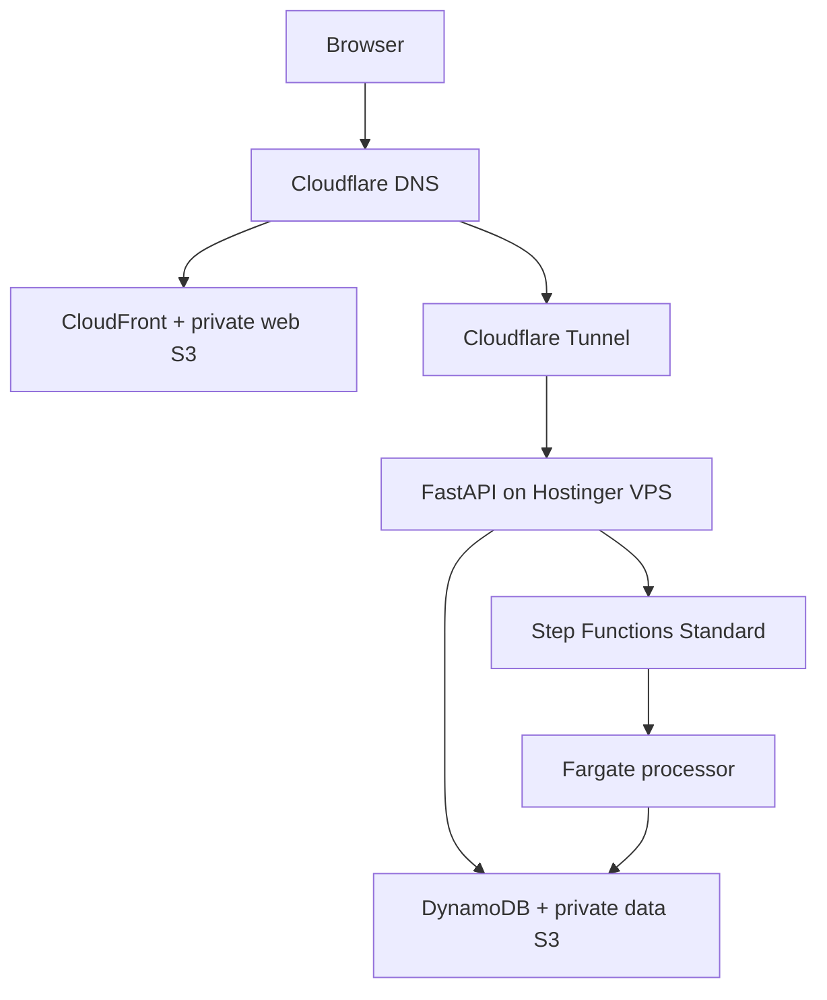

# CnesData Production Deployment Design

**Date:** 2026-08-29  
**Status:** Draft for repository review; architecture approved in design discussion  
**Repository:** `VINIClUS/CnesData`  
**Integration base:** `develop`  
**Production domains:** `cnesdata.vinisantana.com`,
`api.cnesdata.vinisantana.com`  
**Primary AWS region:** `us-east-2`; global edge control plane (ACM,
CloudFront-scoped WAF and Pricing Plan Manager endpoint): `us-east-1`

## 1. Purpose

Define the first cost-bounded production deployment of the target CnesData AWS
profile. The frontend is served through CloudFront from a private S3 origin, the
FastAPI control-plane/API runs on the personal Hostinger VPS, and data processing
runs on demand in Step Functions Standard and ECS Fargate.

This specification supplies the production-resource, identity, network,
delivery, rollback and operations contract intentionally left out of the
existing AWS Runtime Profile implementation plan.

It does not authorize immediate deployment of the repository's current legacy
Compose stack. PostgreSQL, MinIO, Keycloak and BigQuery remain implementation
history and migration inputs only; none is provisioned in the target production
profile.

## 2. Governing designs and precedence

This document composes, rather than replaces:

- `2026-08-16-parquet-data-plane-orchestration-design.md`;
- `2026-08-23-cnesdata-redesign-execution-design.md`;
- `2026-08-28-cnesdata-phase2-readiness-and-adapter-hardening-design.md`;
- `2026-08-23-cnesdata-aws-runtime-profile-implementation-plan.md`;
- `2026-08-23-cnesdata-source-migration-cutover-implementation-plan.md`.

Domain, manifest, publication, fencing, outbox, serving and tenant-isolation
contracts in those documents take precedence over deployment convenience.

Where examples in an application plan use `us-east-1`, this production
deployment supplies `AWS_REGION=us-east-2`. Only ACM certificates and
CloudFront-scoped WAF resources are created through the `us-east-1` provider;
the global Pricing Plan Manager API is also invoked at its `us-east-1`
endpoint.

## 3. Release boundary and readiness gates

### 3.1 Infrastructure may be planned when

- CND-020 through CND-025 are integrated and the exact `develop` SHA passes the
  Phase 2 gate;
- the OpenTofu module can validate without application runtime resources;
- shared state, KMS, GitHub OIDC and budget controls from
  `personal-infra-live` exist;
- the expected CnesData monthly base/max cost remains inside the USD 8 product
  envelope and the aggregate base remains below USD 15.

### 3.2 Runtime may be promoted when

- AWS-010 through AWS-014 and the serial AWS acceptance gate are integrated on
  a green `develop` SHA;
- the produced API and processor images pass the existing CND/AWS contract
  suites;
- the target composition contains no runtime imports or configuration fallback
  for PostgreSQL, MinIO, Keycloak or BigQuery;
- one synthetic CNES vertical slice completes
  `NORMALIZE -> RECONCILE -> MATERIALIZE` and publishes the expected serving
  fixture;
- Cognito/OIDC, tenant membership, signed serving and cross-tenant denial smoke
  tests pass against real AWS resources;
- rollback to the previous API digest, task definition and frontend entrypoint
  has been rehearsed.

### 3.3 Source enablement

The first public deployment is a technical portfolio demo. It contains one
demo tenant and versioned synthetic fixtures with no person, patient, employee
or municipal production data.

`CNES_NACIONAL` ingestion is disabled until CND-033 has a ratified official
DATASUS bulk-distribution contract and the corresponding adapter passes its
source contract and provenance tests. Enabling it is a separate release flag
and plan. Local CNES, SIHD, BPA/SIA sources and the municipal Edge Agent are not
connected to this environment.

The project may not claim completion of the full legacy cutover until MIG-010
through MIG-015 and their final local/AWS acceptance matrix are complete.

## 4. Target topology



The browser never reaches the VPS for frontend assets. The API has no public
origin port. Fargate has no load balancer and no idle service.

## 5. Component ownership

| Component | Owner | Responsibility |
|---|---|---|
| Web S3, CloudFront, ACM, dedicated WAF | CnesData OpenTofu | Static SPA distribution |
| CloudFront Free subscription | CnesData release contract | Exact distribution/WAF binding |
| DynamoDB control plane | CnesData OpenTofu | Canonical multi-tenant state |
| Data and audit S3 | CnesData OpenTofu | Immutable datasets and audit |
| Step Functions/ECS/ECR | CnesData OpenTofu | On-demand processing |
| Cognito | CnesData OpenTofu | Selected generic OIDC issuer |
| Athena workgroup | CnesData OpenTofu | Manual bounded analytics |
| Tunnel/API DNS | `personal-infra-live` | Shared edge and routing |
| VPS baseline/Nginx/deployer | `infra-ansible` via live inventory | Host runtime boundary |
| Application images/manifests | CnesData CI | Tested immutable release |

No two OpenTofu states manage the same resource. Product outputs expose only
the CloudFront distribution domain, API loopback contract and required DNS
validation values to the shared edge change.

## 6. Static frontend

### 6.1 Origin and distribution

- one private S3 web bucket in `us-east-2`;
- S3 Block Public Access enabled at account and bucket level;
- CloudFront Origin Access Control with a bucket policy limited to the exact
  distribution;
- CloudFront Free flat-rate plan, with no automatic upgrade;
- one dedicated, CloudFront-scoped AWS WAF web ACL in `us-east-1`, required by
  that plan and not shared with LimnoPulse;
- ACM certificate in `us-east-1`, validated through Cloudflare DNS;
- `cnesdata.vinisantana.com` as a DNS-only Cloudflare CNAME to CloudFront;
- TLS redirect and a modern security policy;
- compression enabled;
- no S3 website endpoint and no public object ACL.

Before DNS cutover, the account-level gate proves Free-plan eligibility and
available quota. A separate manual, idempotent Pricing Plan Manager API step in
`us-east-1` binds this exact distribution and WAF to an exact `FREE`
subscription, then verifies `ACTIVE`. The current AWS provider has no supported
subscription resource, so this step is outside OpenTofu state but inside the
signed deployment evidence and subsequent drift checks. Failure stops rollout;
it never selects pay-as-you-go or a paid tier implicitly.

### 6.2 Release layout and cache policy

The dashboard build is deterministic and contains no secret. It receives only
public configuration such as API base URL, Cognito issuer/client ID and release
ID.

Deployment order:

1. upload hashed assets without deleting prior releases;
2. verify checksums and content types;
3. upload the new root entrypoint last;
4. invalidate `/index.html` and other un-hashed entrypoints only;
5. run unauthenticated load and authenticated contract smoke tests.

Cache headers:

- hashed assets: `public,max-age=31536000,immutable`;
- `index.html`, manifest and service worker: `no-cache` or a bounded equivalent;
- error responses: not cached when they may hide a fixed deployment.

S3 versioning preserves entrypoint rollback. A lifecycle retains recent
releases within the CloudFront Free plan's 5 GB origin allowance and removes
unreferenced noncurrent objects only after the rollback window.

SPA routes use a small deterministic CloudFront Function rewrite to
`/index.html`; it must not rewrite API paths, assets with extensions or known
metadata files.

### 6.3 Security headers

CloudFront applies HSTS after domain validation, `X-Content-Type-Options`, a
frame policy, `Referrer-Policy`, `Permissions-Policy` and a CSP limited to the
static origin, Cognito endpoints, the API hostname and required S3 signed-serving
downloads. CSP starts in report-only during validation and becomes enforcing
before production acceptance.

## 7. API on the VPS

The API image is built from `apps/central_api` and published privately to GHCR.
Production pulls use the ephemeral workflow `GITHUB_TOKEN`; no GitHub PAT is
stored on the host.

The container:

- runs as a fixed non-root UID;
- has a read-only root filesystem, bounded tmpfs and no Linux capabilities;
- publishes one port to `127.0.0.1` only;
- has CPU, memory, PID and log-size limits compatible with the KVM 2 host;
- mounts only public configuration and the CnesData temporary AWS credential
  directory read-only, so atomic host-side refreshes remain visible;
- has no Docker socket, host network or access to LimnoPulse volumes/networks;
- reports liveness separately from readiness;
- emits redacted JSON stdout and optional loopback metrics.

Nginx exposes it only through `api.cnesdata.vinisantana.com` on the shared
Tunnel. It restores the Cloudflare client address only from the local tunnel,
adds request IDs and applies general plus expensive-job rate limits.

The application remains the authority for:

- membership and tenant authorization;
- per-user/tenant job quotas;
- idempotency keys;
- maximum concurrent and monthly demo jobs;
- signed-serving allowlists;
- audit events for denied and accepted mutations.

## 8. Authentication and demo tenancy

Production sets `PROFILE=aws` and `AUTH_MODE=oidc`. Cognito Lite is the selected
issuer preset, but application/domain interfaces remain provider-neutral.

The deployment creates:

- one User Pool;
- one public SPA client using Authorization Code + PKCE and no client secret;
- exact callback/logout URLs for the production domain;
- email-based development/demo accounts created out of band;
- no SMS MFA, paid SMS, social IdP or machine-to-machine client.

Tokens establish issuer, audience and subject only. Tenant membership is
resolved server-side through canonical DynamoDB keys. A tenant claim, header,
URL parameter, object key or GSI candidate can never grant access without the
base membership check.

One demo tenant is seeded idempotently. The seed operation records IDs and
hashes only, can never overwrite an existing non-demo tenant and has no bulk
delete path.

## 9. DynamoDB

One on-demand control-plane table per environment implements the accepted
single-table layout.

Required deployment controls:

- `PAY_PER_REQUEST` billing;
- PITR enabled for 35 days;
- AWS-owned table encryption or the approved shared KMS key where the access
  policy remains simple and cost-neutral;
- TTL enabled only for garbage collection;
- maximum on-demand throughput initially capped at 100 reads/second and 25
  writes/second for the table and every GSI;
- Contributor Insights and global tables disabled;
- deletion protection and lifecycle protection;
- alarms for throttles, system errors and sustained consumption.

The API and processor roles receive only their required table/index actions.
No GitHub role has routine data-plane write access; demo seeding uses a separate
manual operation role.

## 10. Data, serving and audit buckets

### 10.1 Data bucket

One private versioned data bucket stores canonical prefixes:

```text
raw/
normalized/
reconciliation/
serving/
tmp/
```

It enforces TLS, blocks public access, uses bucket-owner-enforced ownership,
aborts incomplete multipart uploads and applies retention/lifecycle by prefix.
Objects are immutable by key and verified by SHA-256. `tmp/` expires after its
bounded recovery window; published raw, reconciliation and serving history is
not deleted by a deployment workflow.

The API may issue a short-lived signed GET only for exact authorized
`serving/<tenant>/<run_id>/...` objects selected by the active
`DatasetPointer`. Raw, normalized, reconciliation, temporary and audit keys are
never signed to the browser. The initial signed URL TTL is 300 seconds.

### 10.2 Audit bucket

A separate versioned bucket is created with Object Lock enabled at creation.
The application contract uses COMPLIANCE retention for its append-only audit
objects and an initial 365-day retention period, matching the accepted
`S3ObjectLockAuditSink` behavior. This is distinct from the Governance-mode
InfluxDB backup bucket.

The real-AWS acceptance gate proves retention and conflict behavior before any
release claims WORM compliance. Emulator success alone is insufficient.

## 11. Processing plane

### 11.1 Step Functions

- Standard workflows only;
- Inline Map only; Distributed Map is rejected;
- exactly the canonical `NORMALIZE`, `RECONCILE`, `MATERIALIZE` wave sequence;
- IDs-only payloads;
- bounded retries with jitter and explicit catch/terminal states;
- execution names derived from canonical dispatch IDs;
- CloudWatch execution logging without data payloads;
- maximum 200 demo executions per month, enforced by the application/control
  plane rather than assumed from billing alerts.

### 11.2 Fargate

- one ECS cluster with no continuously running service;
- tasks launched only by Step Functions;
- Linux/x86_64, initial size 0.25 vCPU and 0.5-1 GiB memory;
- included 20 GB ephemeral storage unless measured otherwise;
- maximum one concurrent task and two-hour task timeout;
- maximum 100 task-hours per month;
- no autoscaling and no Fargate Spot in the first release;
- public subnets with an ephemeral public IPv4, no inbound security-group rule,
  and no NAT Gateway or load balancer;
- free S3 and DynamoDB gateway endpoints where compatible; other required AWS
  APIs use TLS over the Internet gateway;
- task execution role limited to ECR pull and CloudWatch logs;
- task role limited to exact DynamoDB/S3/Step Functions application actions.

The network design deliberately trades an ephemeral public IPv4 during task
execution for avoiding a NAT Gateway whose fixed monthly cost would exceed the
entire project budget. The task has no listening service or inbound route.

### 11.3 ECR

Only the Fargate processor requires ECR. CI builds once, identifies the GHCR
digest and promotes byte-identical content to a private ECR repository in
`us-east-2`.

Lifecycle policy:

- retain at most five production digests for 30 days;
- expire untagged images after seven days;
- keep the currently deployed and immediately previous digest regardless of a
  routine cleanup calculation;
- scan on push and block promotion on a reviewed severity policy.

The VPS API continues to use GHCR. ECR is not a general duplicate registry.

## 12. Athena

Athena is an operator-only analytical path, never an API request dependency.

- one workgroup with enforced configuration;
- 5 GB bytes-scanned cutoff per query;
- 100 GB logical monthly scan budget, approximately USD 0.50 at USD 5/TB;
- encrypted, lifecycle-managed result prefix;
- no scheduled queries, Spark, provisioned capacity or browser credentials;
- Parquet partition pruning required in runbooks/examples;
- application roles cannot start Athena queries.

## 13. IAM and secrets

No static AWS access key is accepted by application settings, GitHub or the
VPS.

- GitHub workflows assume repository/workflow-scoped OIDC roles.
- The VPS API obtains short-lived credentials through its CnesData Roles
  Anywhere profile and host-side credential renewer.
- Fargate uses task roles.
- Runtime non-AWS secrets use SSM SecureString under
  `/personal/prod/cnesdata/runtime/` and the approved customer-managed KMS key.
- Containers receive temporary rendered files from `/run`; no persistent
  `.env` file is created.
- Cognito identifiers, bucket names and API URLs are configuration, not secret
  values.

IAM policies distinguish API, processor, task execution, GitHub plan, GitHub
apply, demo seed, audit verification and human break-glass duties. Wildcard
resource permissions require an AWS API that cannot be narrowed further and a
documented condition boundary.

## 14. OpenTofu design

Product infrastructure lives under an application-owned OpenTofu root and uses
the private shared S3 backend key `cnesdata/prod/opentofu.tfstate` with native
locking.

Modules separate:

- static web/CDN/certificate;
- identity;
- control plane;
- data/audit storage;
- processing/network/ECR;
- Athena;
- logging/alarms/IAM.

Every resource carries `Project=cnesdata`, `Environment=prod`,
`ManagedBy=opentofu`, `Owner=vinisantana`. The plan fails on NAT Gateway, ALB,
RDS/Aurora, Redshift, OpenSearch, ElastiCache, Global Tables, multi-region
replication or an unapproved paid plan.

There is no destroy workflow. Protected buckets, DynamoDB, KMS references and
state use lifecycle/policy safeguards. A replacement plan for any protected
resource fails before an apply artifact is issued.

## 15. CI/CD

### 15.1 Continuous integration

Pull requests to `develop` run the existing locked Python/CND/AWS gates plus:

- dashboard lint, typecheck, tests and deterministic production build;
- API and processor image build tests;
- OCI vulnerability scan and SBOM generation;
- OpenTofu format/validate/test and provider-lock verification;
- policy and cost-manifest checks;
- release-manifest schema and secret-scan tests.

Untrusted pull-request code runs only on GitHub-hosted runners and receives no
AWS, Cloudflare or SSH credential.

### 15.2 Release creation

A candidate release is bound to one green `develop` commit and records:

- source SHA and test run IDs;
- API GHCR digest;
- processor GHCR and promoted ECR digests;
- dashboard artifact checksum;
- Compose/config checksum;
- OpenTofu/provider lock digest;
- SBOM checksums and schema version.

Mutable tags may aid discovery but are never deployment authority.

### 15.3 Infrastructure plan/apply

Plan and apply are separate manual workflows. Apply downloads and verifies the
exact unexpired binary plan; it does not replan. GitHub OIDC supplies temporary
AWS credentials. The paid Actions spending limit is USD 0.

### 15.4 Application promotion

Production promotion is `workflow_dispatch` only. It verifies that the release
SHA is contained in `develop`, all required checks succeeded and the cost-freeze
marker is absent.

Order:

1. promote/verify the processor digest in ECR;
2. update the inactive API candidate on the VPS;
3. pass local and tunneled health/authorization smoke tests;
4. switch Nginx to the candidate;
5. publish frontend assets and entrypoint;
6. run the synthetic vertical slice and serving test;
7. record redacted evidence and retain the previous release.

No production deployment occurs automatically after merge.

## 16. Rollback

- **API:** restore the previous Nginx upstream and already-pulled GHCR digest.
- **Frontend:** restore the prior versioned entrypoint and invalidate it.
- **Processor:** register/select the previous task definition/digest for new
  dispatches; active Standard executions continue with the definition they
  started unless the runbook determines cancellation is safe.
- **State machine:** revert only new-execution routing; do not edit an active
  execution or DynamoDB record manually.
- **DynamoDB/S3:** application releases never roll data backward or delete
  published versions. Compatibility changes are expand/contract and additive.
- **Infrastructure:** failed apply requires diagnosis and a new reviewed plan;
  protected-resource restore is not an automatic rollback step.

## 17. Rate limiting and abuse containment

- Cloudflare Free rule protects the most sensitive public job/auth surface.
- Nginx enforces IP-based general and expensive-mutation zones.
- The API enforces tenant/user/idempotency quotas and maximum 200 jobs,
  100 task-hours and one concurrent processor task per month/environment.
- DynamoDB maximum throughput, Step Functions bounded retries and Athena bytes
  cutoffs contain downstream amplification.
- Requests beyond product quota fail with `429` or the documented quota error
  before starting Step Functions or Athena.
- A USD 15 aggregate budget action freezes new Fargate, Step Functions and
  Athena starts through automation roles while preserving reads and backups.

## 18. Observability and SLOs

Initial internal targets:

- static frontend availability 99.9%;
- API availability 99.5%;
- eligible processing-job success 99%;
- routine API p95 below two seconds;
- routine deployment interruption at most 60 seconds.

Grafana Alloy collects VPS/API/Nginx/Tunnel telemetry without Docker-socket
access. CloudWatch owns DynamoDB, Step Functions, ECS, S3 and Athena alarms.
Fargate logs retain seven days. High-cardinality tenant, run, object-key and
user labels are forbidden.

Required alarms include API/tunnel health, DynamoDB throttles/errors, failed or
timed-out Step Functions executions, ECS task failures, audit/outbox backlog,
S3 access denial, Athena cutoff, budget thresholds and anomaly detection.

## 19. Backup and recovery

- DynamoDB PITR: 35 days;
- S3 data/audit: versioning and prefix-specific lifecycle/Object Lock;
- static entrypoint: versioned rollback;
- infrastructure state: encrypted/versioned S3 backend;
- no cross-region replica in phase 1;
- quarterly recovery exercise reconstructs the API and proves one synthetic
  dataset pointer/serving object without altering production data;
- destructive PITR export/restore requires a separately approved runbook run.

## 20. Test and acceptance matrix

### 20.1 Pre-production tests

- all CND adapter and AWS-014 matrices on the exact release SHA;
- real-AWS DynamoDB transaction/TTL and S3 Object Lock capability checks;
- OIDC/JWKS rotation, revoked membership and cross-tenant denial;
- old fence/dispatch rejection and duplicate execution replay;
- required-source failure and optional-source degraded publication;
- pointer CAS race, S3 failure before publication and outbox replay;
- no presigned URL for non-serving prefixes;
- CDN private-origin, SPA rewrite, CSP and cache rollback;
- CloudFront Free eligibility plus exact `ACTIVE` distribution/WAF binding;
- Nginx and application rate-limit behavior;
- plan policy, cost envelope and protected-resource replacement denial.

### 20.2 Production smoke

- static site returns the expected release ID over TLS;
- S3 origin is not publicly readable;
- API is unreachable at the VPS address/ports and healthy through Tunnel;
- demo user authenticates with PKCE and resolves only the demo tenant;
- one synthetic run publishes exactly one new immutable version/pointer;
- serving redirect is short-lived and limited to the expected JSON;
- logs, traces, state and artifacts contain no secret or synthetic record body;
- previous API/frontend release can be restored within the documented window.

## 21. Cost contract

CnesData receives a USD 8 monthly operational envelope. Expected initial use is
approximately USD 2-6 depending on Fargate jobs and stored data.

Cost controls:

- CloudFront Free plan and web origin below 5 GB;
- one of the account's maximum three CloudFront Free-plan subscriptions, with
  eligibility and `ACTIVE` status checked before cutover;
- ECR generally below 2 GB;
- one Fargate task, zero idle desired count, 100 task-hours maximum;
- Step Functions Standard and 200 executions maximum;
- Athena 5 GB/query and 100 GB/month;
- DynamoDB on-demand maximum throughput;
- short CloudWatch retention and no Container Insights;
- no NAT Gateway, load balancer, RDS or multi-region resource;
- monthly review for the first three months and re-baseline if the project
  exceeds its envelope or aggregate forecast reaches USD 15.

## 22. Definition of done

- This specification is reviewed and its implementation plan is approved.
- Required CND and AWS logical gates are green on integrated `develop`.
- OpenTofu plan contains only approved resources and costs.
- All production artifacts are immutable and traceable to one source SHA.
- Static origin, API origin and AWS data resources are not publicly writable.
- No long-lived AWS or GitHub credential exists on the VPS or in GitHub.
- Synthetic portfolio data is clearly identified; municipal/local data paths
  are absent.
- Deploy, rollback, rate-limit, cost-freeze and recovery drills pass.
- `cnesdata.vinisantana.com` and `api.cnesdata.vinisantana.com` satisfy their
  health, TLS and isolation contracts.
- The deployment makes no claim that DATASUS ingestion or legacy cutover is
  complete before their governing gates pass.

## 23. References

- Amazon ECS private registry authentication:
  <https://docs.aws.amazon.com/AmazonECS/latest/developerguide/private-auth.html>
- AWS Step Functions ECS integration:
  <https://docs.aws.amazon.com/step-functions/latest/dg/connect-ecs.html>
- Amazon DynamoDB on-demand maximum throughput:
  <https://docs.aws.amazon.com/amazondynamodb/latest/developerguide/on-demand-capacity-mode-max-throughput.html>
- Amazon S3 Object Lock:
  <https://docs.aws.amazon.com/AmazonS3/latest/userguide/object-lock.html>
- Amazon CloudFront Origin Access Control:
  <https://docs.aws.amazon.com/AmazonCloudFront/latest/DeveloperGuide/private-content-restricting-access-to-s3.html>
- Amazon CloudFront flat-rate plan quotas:
  <https://docs.aws.amazon.com/AmazonCloudFront/latest/DeveloperGuide/flat-rate-pricing-plan.html>
- AWS Pricing Plan Manager API:
  <https://docs.aws.amazon.com/PricingPlanManager/latest/UserGuide/getting-started-pricingplanmanager-api.html>
