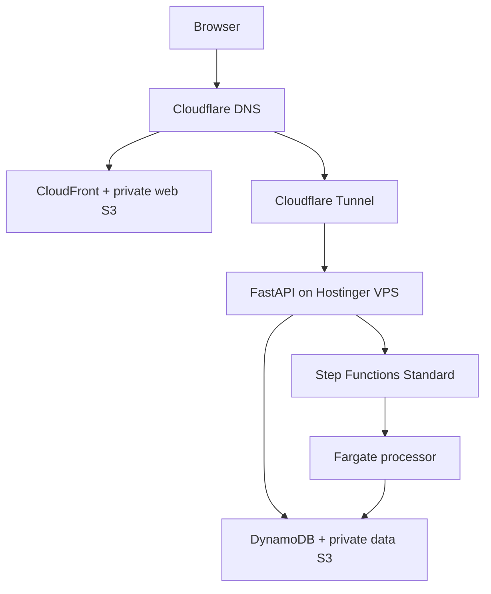

# CnesData Production Deployment Design

**Date:** 2026-08-29  
**Status:** Draft for repository review; architecture approved in design discussion  
**Repository:** `VINIClUS/CnesData`  
**Integration base:** `develop`  
**Production domains:** `cnesdata.vinisantana.com`,
`api.cnesdata.vinisantana.com`  
**Primary AWS region:** `us-east-2`; global edge control plane (ACM,
CloudFront-scoped WAF and Pricing Plan Manager endpoint): `us-east-1`

## 1. Purpose

Define the first cost-bounded production deployment of the target CnesData AWS
profile. The frontend is served through CloudFront from a private S3 origin, the
FastAPI control-plane/API runs on the personal Hostinger VPS, and data processing
runs on demand in Step Functions Standard and ECS Fargate.

This specification supplies the production-resource, identity and network
contract intentionally left out of the existing AWS Runtime Profile
implementation plan. The delivery and operations contract is in the related
[production operations design](2026-08-29-cnesdata-production-operations-design.md).

It does not authorize immediate deployment of the repository's current legacy
Compose stack. PostgreSQL, MinIO, Keycloak and BigQuery remain implementation
history and migration inputs only; none is provisioned in the target production
profile.

## 2. Governing designs and precedence

This document composes, rather than replaces:

- `2026-08-16-parquet-data-plane-orchestration-design.md`;
- `2026-08-23-cnesdata-redesign-execution-design.md`;
- `2026-08-28-cnesdata-phase2-readiness-and-adapter-hardening-design.md`;
- `2026-08-23-cnesdata-aws-runtime-profile-implementation-plan.md`;
- `2026-08-23-cnesdata-source-migration-cutover-implementation-plan.md`.

Domain, manifest, publication, fencing, outbox, serving and tenant-isolation
contracts in those documents take precedence over deployment convenience.

The following production AWS-012 override is binding. The generic AWS-012
fixture/validator with `AssignPublicIp=DISABLED` does not govern this profile.
Before a SHA can pass AWS-012, `validate_state_machine` must validate
`AssignPublicIp=ENABLED`, the exact configured public subnet IDs and security
group, zero security-group ingress, `FARGATE` launch type, maximum concurrency
of one, and no NAT Gateway or ALB. Implementing this delta is a mandatory gate
for the production profile.

Where examples in an application plan use `us-east-1`, this production
deployment supplies `AWS_REGION=us-east-2`. Only ACM certificates and
CloudFront-scoped WAF resources are created through the `us-east-1` provider;
the global Pricing Plan Manager API is also invoked at its `us-east-1`
endpoint.

## 3. Release boundary and readiness gates

### 3.1 Infrastructure may be planned when

- CND-020 through CND-025 are integrated and the exact `develop` SHA passes the
  Phase 2 gate;
- the OpenTofu module can validate without application runtime resources;
- shared state, KMS, GitHub OIDC and budget controls from
  `personal-infra-live` exist;
- the expected CnesData monthly base/max cost remains inside the USD 8 product
  envelope and the aggregate base remains below USD 15.

### 3.2 Runtime may be promoted when

- AWS-010 through AWS-014 and the serial AWS acceptance gate are integrated on
  a green `develop` SHA;
- the produced API and processor images pass the existing CND/AWS contract
  suites;
- the target composition contains no runtime imports or configuration fallback
  for PostgreSQL, MinIO, Keycloak or BigQuery;
- one synthetic CNES vertical slice completes
  `NORMALIZE -> RECONCILE -> MATERIALIZE` and publishes the expected serving
  fixture;
- Cognito/OIDC, tenant membership, signed serving and cross-tenant denial smoke
  tests pass against real AWS resources;
- rollback to the previous API digest, task definition and frontend entrypoint
  has been rehearsed.

### 3.3 Source enablement

The first public deployment is a technical portfolio demo. It contains one
demo tenant and versioned synthetic fixtures with no person, patient, employee
or municipal production data.

`CNES_NACIONAL` ingestion is disabled until CND-033 has a ratified official
DATASUS bulk-distribution contract and the corresponding adapter passes its
source contract and provenance tests. Enabling it is a separate release flag
and plan. Local CNES, SIHD, BPA/SIA sources and the municipal Edge Agent are not
connected to this environment.

The project may not claim completion of the full legacy cutover until MIG-010
through MIG-015 and their final local/AWS acceptance matrix are complete.

## 4. Target topology



The browser never reaches the VPS for frontend assets. The API has no public
origin port. Fargate has no load balancer and no idle service.

## 5. Component ownership

| Component | Owner | Responsibility |
|---|---|---|
| Web S3, CloudFront, ACM, dedicated WAF | CnesData OpenTofu | Static SPA distribution |
| CloudFront Free subscription | CnesData release contract | Exact distribution/WAF binding |
| DynamoDB control plane | CnesData OpenTofu | Canonical multi-tenant state |
| Data and audit S3 | CnesData OpenTofu | Immutable datasets and audit |
| Step Functions/ECS/ECR | CnesData OpenTofu | On-demand processing |
| Cognito | CnesData OpenTofu | Selected generic OIDC issuer |
| Athena workgroup | CnesData OpenTofu | Manual bounded analytics |
| Tunnel/API DNS | `personal-infra-live` | Shared edge and routing |
| VPS baseline/Nginx/deployer | `infra-ansible` via live inventory | Host runtime boundary |
| Application images/manifests | CnesData CI | Tested immutable release |

No two OpenTofu states manage the same resource. Product outputs expose only
the CloudFront distribution domain, API loopback contract and required DNS
validation values to the shared edge change.

## 6. Static frontend

### 6.1 Origin and distribution

- one private S3 web bucket in `us-east-2`;
- S3 Block Public Access enabled at account and bucket level;
- CloudFront Origin Access Control with a bucket policy limited to the exact
  distribution;
- CloudFront Free flat-rate plan, with no automatic upgrade;
- one dedicated, CloudFront-scoped AWS WAF web ACL in `us-east-1`, required by
  that plan and not shared with LimnoPulse;
- ACM certificate in `us-east-1`, validated through Cloudflare DNS;
- `cnesdata.vinisantana.com` as a DNS-only Cloudflare CNAME to CloudFront;
- TLS redirect and a modern security policy;
- compression enabled;
- no S3 website endpoint and no public object ACL.

Before DNS cutover, the account-level gate proves Free-plan eligibility and
available quota. A separate manual, idempotent Pricing Plan Manager API step in
`us-east-1` binds this exact distribution and WAF to an exact `FREE`
subscription, then verifies `ACTIVE`. The current AWS provider has no supported
subscription resource, so this step is outside OpenTofu state but inside the
signed deployment evidence and subsequent drift checks. Failure stops rollout;
it never selects pay-as-you-go or a paid tier implicitly.

### 6.2 Release layout and cache policy

The dashboard build is deterministic and contains no secret. It receives only
public configuration such as
`VITE_API_BASE_URL=https://api.cnesdata.vinisantana.com/api/v1`, Cognito
issuer/client ID and release ID. The OpenTofu output maps that exact value to
the dashboard build variable `VITE_API_BASE_URL`.

Every dashboard API call, including `auth/me` and activation, uses one
authenticated client bound to
`https://api.cnesdata.vinisantana.com/api/v1`. Production forbids relative
`/api` requests. That client sends a bearer token only to the API origin
`https://api.cnesdata.vinisantana.com` and sends `X-Tenant-Id` only for
tenant-scoped calls.

Deployment order:

1. upload hashed assets without deleting prior releases;
2. verify checksums and content types;
3. upload the new root entrypoint last;
4. invalidate `/index.html` and other un-hashed entrypoints only;
5. run unauthenticated load and authenticated contract smoke tests.

Cache headers:

- hashed assets: `public,max-age=31536000,immutable`;
- `index.html`, manifest and service worker: `no-cache` or a bounded equivalent;
- error responses: not cached when they may hide a fixed deployment.

S3 versioning preserves entrypoint rollback. A lifecycle retains recent
releases within a voluntary 5 GB operational cap for the web bucket, aligned
with the CloudFront Free plan's account-wide 5 GB S3 Standard credit, and
removes unreferenced noncurrent objects only after the rollback window.

SPA routes use a small deterministic CloudFront Function rewrite to
`/index.html`; it must not rewrite API paths, assets with extensions or known
metadata files.

### 6.3 Security headers

CloudFront applies HSTS after domain validation, `X-Content-Type-Options`, a
frame policy, `Referrer-Policy`, `Permissions-Policy` and a CSP limited to the
static origin, Cognito endpoints, the API hostname and required S3 signed-serving
downloads. CSP starts in report-only during validation and becomes enforcing
before production acceptance.

## 7. API on the VPS

The API image is built from `apps/central_api` and published privately to GHCR.
Production pulls use the ephemeral workflow `GITHUB_TOKEN`; no GitHub PAT is
stored on the host.

The container:

- runs as a fixed non-root UID;
- has a read-only root filesystem, bounded tmpfs and no Linux capabilities;
- publishes one port to `127.0.0.1` only;
- has CPU, memory, PID and log-size limits compatible with the KVM 2 host;
- sets `AWS_CONFIG_FILE` to a read-only config containing a named profile whose
  `credential_process` invokes IAM Roles Anywhere
  `aws_signing_helper credential-process`;
- mounts read-only only that config plus the strictly necessary X.509 material
  and helper; the host-owned key is readable only by the fixed runtime UID;
- accepts neither `AWS_ACCESS_KEY_ID`, `AWS_SECRET_ACCESS_KEY` or
  `AWS_SESSION_TOKEN` nor shared static credentials;
- has no Docker socket, host network or access to LimnoPulse volumes/networks;
- reports liveness separately from readiness;
- emits redacted JSON stdout and optional loopback metrics.

Nginx exposes it only through `api.cnesdata.vinisantana.com` on the shared
Tunnel. It restores the Cloudflare client address only from the local tunnel
and adds request IDs. It forwards `OPTIONS` requests to FastAPI and neither
terminates preflight requests nor adds CORS headers.

FastAPI is the sole CORS authority. Its CORS policy permits exactly the origin
`https://cnesdata.vinisantana.com`, methods `GET` and `POST`, and request
headers `Authorization`, `Content-Type` and `X-Tenant-Id`. It permits no
credentials and contains no wildcard origin, method or header.

The application remains the authority for:

- membership and tenant authorization;
- per-user/tenant job quotas;
- idempotency keys;
- maximum concurrent and monthly demo jobs;
- signed-serving allowlists;
- audit events for denied and accepted mutations.

## 8. Authentication and demo tenancy

Production sets `PROFILE=aws` and `AUTH_MODE=oidc`. Cognito Lite is the selected
issuer preset, but application/domain interfaces remain provider-neutral.

The deployment creates:

- one User Pool;
- one public SPA client using Authorization Code + PKCE and no client secret,
  with `AllowedOAuthScopes` containing
  `https://api.cnesdata.vinisantana.com/api.access` alongside existing OIDC
  scopes;
- one resource server with identifier `https://api.cnesdata.vinisantana.com`
  and one custom `api.access` scope;
- one collision-safe AWS-managed prefix domain for the User Pool, generated
  from the production environment and a unique suffix, with no custom Cognito
  domain, certificate or DNS resource;
- exact callback/logout URLs for the production domain;
- email-based development/demo accounts created out of band;
- no SMS MFA, paid SMS, social IdP or machine-to-machine client.

The dashboard requests `https://api.cnesdata.vinisantana.com/api.access`
alongside existing OIDC scopes and passes
`resource=https://api.cnesdata.vinisantana.com` in its authorization request.
The resulting access token contains
`aud=https://api.cnesdata.vinisantana.com`. Production config sets
`OIDC_AUDIENCE=https://api.cnesdata.vinisantana.com`. The dashboard continues
to send the `access_token`; the verifier remains provider-neutral.

Authorization Code + PKCE requires the AWS-managed prefix domain. Its public
dashboard configuration and OpenTofu outputs include `COGNITO_DOMAIN` plus the
absolute `COGNITO_AUTHORIZE_URL`, `COGNITO_TOKEN_URL` and `COGNITO_LOGOUT_URL`
for `/oauth2/authorize`, `/oauth2/token` and `/logout`. Cognito Lite uses these
standard endpoints without depending on managed login v2 branding or features.

Tokens establish issuer, audience and subject only. Tenant membership is
resolved server-side through canonical DynamoDB keys. A tenant claim, header,
URL parameter, object key or GSI candidate can never grant access without the
base membership check.

One demo tenant is seeded idempotently. The seed operation records IDs and
hashes only, can never overwrite an existing non-demo tenant and has no bulk
delete path.

## 9. DynamoDB

One on-demand control-plane table per environment implements the accepted
single-table layout.

Required deployment controls:

- `PAY_PER_REQUEST` billing;
- PITR enabled for 35 days;
- AWS-owned table encryption or the approved shared KMS key where the access
  policy remains simple and cost-neutral;
- TTL enabled only for garbage collection;
- maximum on-demand throughput initially capped at 100 reads/second and 25
  writes/second for the table and every GSI;
- Contributor Insights and global tables disabled;
- deletion protection and lifecycle protection;
- alarms for throttles, system errors and sustained consumption.

The API and processor roles receive only their required table/index actions.
No GitHub role has routine data-plane write access; demo seeding uses a separate
manual operation role.

## 10. Data, serving and audit buckets

### 10.1 Data bucket

One private versioned data bucket stores canonical prefixes:

```text
raw/
normalized/
reconciliation/
serving/
tmp/
```

It enforces TLS, blocks public access, uses bucket-owner-enforced ownership,
aborts incomplete multipart uploads and applies retention/lifecycle by prefix.
Objects are immutable by key and verified by SHA-256. `tmp/` expires after its
bounded recovery window; published raw, reconciliation and serving history is
not deleted by a deployment workflow.

The first API call remains authenticated and tenant-authorized with
`X-Tenant-Id`. It returns `200` with `Cache-Control: private, no-store` and an
envelope containing only `url`, `version_id` and `expires_in=300`. There are no
separate tenant or object-key fields, but the SigV4 URL necessarily contains
the exact authorized `serving/<tenant>/<run_id>/...` key in its path. The URL is
bearer-sensitive and must never be logged, persisted, included in telemetry,
referrer or cache. Raw, normalized, reconciliation, temporary and audit keys
are never signed to the browser; no other prefix may be signed.

The dashboard then makes a second `fetch` directly to the signed S3 URL with
credentials omitted and without `Authorization`, `X-Tenant-Id`, cookies or any
other custom request header. This production handoff replaces the AWS-014
`307` route contract before promotion.

The data bucket CORS configuration permits exactly
`https://cnesdata.vinisantana.com`, methods `GET` and `HEAD`, no custom request
headers, no credentials, and `MaxAgeSeconds=300`. Browser-readable objects are
limited to signed URLs under `serving/`; no other prefix is browser-readable.

### 10.2 Audit bucket

A separate versioned bucket is created with Object Lock enabled at creation.
The application contract uses COMPLIANCE retention for its append-only audit
objects and an initial 365-day retention period, matching the accepted
`S3ObjectLockAuditSink` behavior. This is distinct from the Governance-mode
InfluxDB backup bucket.

The real-AWS acceptance gate proves retention and conflict behavior before any
release claims WORM compliance. Emulator success alone is insufficient.

## 11. Processing plane

### 11.1 Step Functions

- Standard workflows only;
- Inline Map only; Distributed Map is rejected;
- exactly the canonical `NORMALIZE`, `RECONCILE`, `MATERIALIZE` wave sequence;
- IDs-only payloads;
- bounded retries with jitter and explicit catch/terminal states;
- execution names derived from canonical dispatch IDs;
- CloudWatch execution logging without data payloads;
- maximum 200 demo executions per month, enforced by the application/control
  plane rather than assumed from billing alerts.

Step Functions uses a separate execution role assumed by `states.amazonaws.com`;
its ECS, EventBridge and `iam:PassRole` permission boundary is operationally
verified in the [production operations design](2026-08-29-cnesdata-production-operations-design.md).

### 11.2 Fargate

- one ECS cluster with no continuously running service;
- unit tasks launched by Step Functions; separate `recover-once` tasks by
  EventBridge Scheduler, under the operations contract;
- Linux/x86_64, initial size 0.25 vCPU and 0.5-1 GiB memory;
- included 20 GB ephemeral storage unless measured otherwise;
- semaphore-enforced maximum one concurrent unit task per environment;
  recovery passes may overlap without a global recovery-concurrency ceiling;
- two-hour unit-task timeout;
- monitored monthly operating target: 100 task-hours counting every unit and
  recovery task-hour;
- no autoscaling and no Fargate Spot in the first release;
- public subnets with an ephemeral public IPv4, no inbound security-group rule,
  and no NAT Gateway or load balancer;
- free S3 and DynamoDB gateway endpoints where compatible; other required AWS
  APIs use TLS over the Internet gateway;
- task execution role limited to ECR pull and CloudWatch logs;
- task role limited to exact DynamoDB/S3/Step Functions application actions.

For this production profile, `validate_state_machine` accepts
`AssignPublicIp=ENABLED` only with the exact configured public subnet IDs and
security group, zero ingress, `FARGATE`, maximum concurrency one, and no NAT
Gateway or ALB. It rejects `DISABLED`, subnet/security-group drift, inbound
rules and every incompatible launch or network configuration.

The network design deliberately trades an ephemeral public IPv4 during task
execution for avoiding a NAT Gateway whose fixed monthly cost would exceed the
entire project budget. The task has no listening service or inbound route.

### 11.3 ECR

Only the Fargate processor requires ECR. CI builds once, identifies the GHCR
digest and promotes byte-identical content to a private ECR repository in
`us-east-2`.

Lifecycle policy:

- retain at most five production digests for 30 days;
- expire untagged images after seven days;
- keep the currently deployed and immediately previous digest regardless of a
  routine cleanup calculation;
- scan on push and block promotion on a reviewed severity policy.

The VPS API continues to use GHCR. ECR is not a general duplicate registry.

## 12. Athena

Athena is an operator-only analytical path, never an API request dependency.

- one workgroup with enforced configuration;
- 5 GB bytes-scanned cutoff per query;
- 100 GB logical monthly scan budget, approximately USD 0.50 at USD 5/TB;
- encrypted, lifecycle-managed result prefix;
- no scheduled queries, Spark, provisioned capacity or browser credentials;
- Parquet partition pruning required in runbooks/examples;
- application roles cannot start Athena queries.

## 13. IAM and secrets

No static AWS access key is accepted by application settings, GitHub or the
VPS.

- GitHub workflows assume repository/workflow-scoped OIDC roles.
- The VPS API uses its named `AWS_CONFIG_FILE` profile and IAM Roles Anywhere
  `aws_signing_helper credential-process`. Its output includes `Expiration`,
  and boto3/botocore refreshes credentials automatically before expiration.
- Fargate uses task roles.
- Runtime non-AWS secrets use SSM SecureString under
  `/personal/prod/cnesdata/runtime/` and the approved customer-managed KMS key.
- Containers receive temporary rendered files from `/run`; no persistent
  `.env` file is created.
- Cognito identifiers, bucket names and API URLs are configuration, not secret
  values.

OpenTofu provisions a `us-east-2` Roles Anywhere trust anchor from an external,
offline CA public PEM and a profile; AWS Private CA is prohibited by the cost
contract. Its role trusts `rolesanywhere.amazonaws.com` for `sts:AssumeRole`,
`sts:TagSession` and `sts:SetSourceIdentity` with `SourceArn` and X.509 identity
conditions. The CA private key and API/VPS leaf credentials never enter the
repository or OpenTofu state; issuance, revocation and recovery are operational.

IAM policies distinguish API, processor, task execution, GitHub plan, GitHub
apply, demo seed, audit verification and human break-glass duties. Wildcard
resource permissions require an AWS API that cannot be narrowed further and a
documented condition boundary.

## 14. OpenTofu design

Product infrastructure lives under an application-owned OpenTofu root and uses
the private shared S3 backend key `cnesdata/prod/opentofu.tfstate` with native
locking.

Modules separate:

- static web/CDN/certificate;
- identity;
- control plane;
- data/audit storage;
- processing/network/ECR;
- Athena;
- logging/alarms/IAM.

Every resource carries `Project=cnesdata`, `Environment=prod`,
`ManagedBy=opentofu`, `Owner=vinisantana`. The plan fails on NAT Gateway, ALB,
RDS/Aurora, Redshift, OpenSearch, ElastiCache, Global Tables, multi-region
replication or an unapproved paid plan.

There is no destroy workflow. Protected buckets, DynamoDB, KMS references and
state use lifecycle/policy safeguards. A replacement plan for any protected
resource fails before an apply artifact is issued.

## 15. Operations contract

Release, rollback, limits, observability, recovery, acceptance, cost and
completion requirements are in the
[production operations design](2026-08-29-cnesdata-production-operations-design.md).
